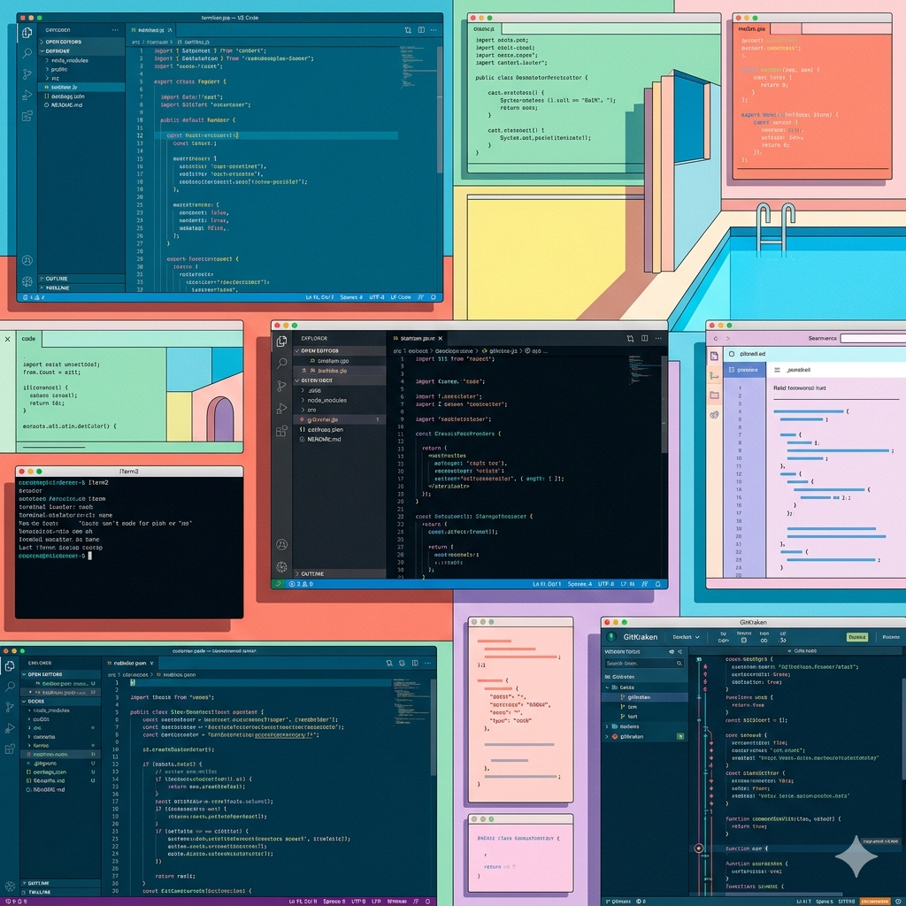
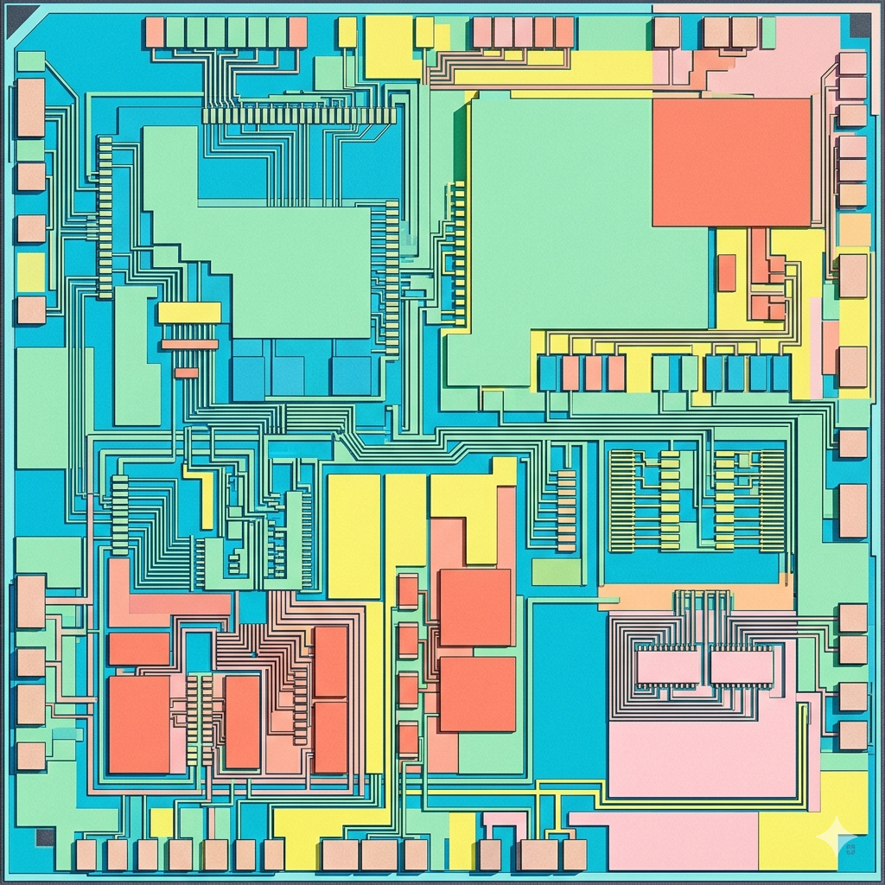
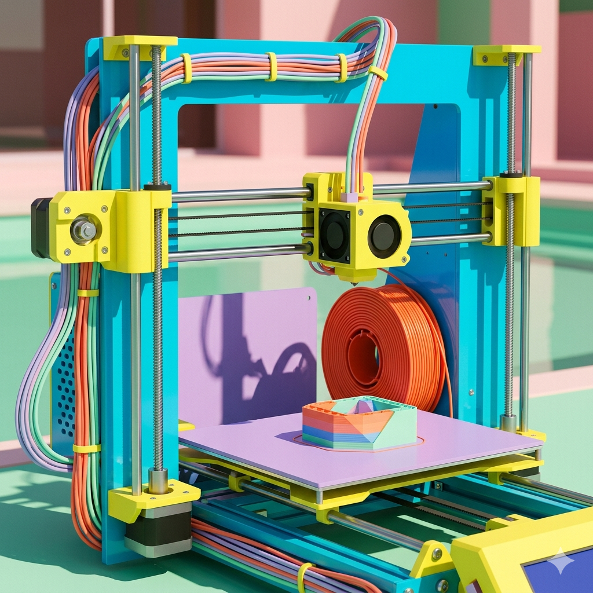

  

### 🔭 About Me

I'm an engineer, maker, and tinkerer who loves bridging the gap between software and the physical world. From high-level developer tooling down to silicon logic and physical fabrication, I enjoy building things end-to-end.

---

### ✨ My Interests

<table align="center">
  <tr>
    <td align="center" width="33%">
      
       
      <b>Tooling</b>
    </td>
    <td align="center" width="33%">
      
       
      <b>Chip Design & FPGAs</b>
    </td>
    <td align="center" width="33%">
      
       
      <b>3D Printing & DIY</b>
    </td>
  </tr>
  <tr>
    <td align="center">Building the tools for my own use. I love creating efficient developer workflows and automating everything in sight.</td>
    <td align="center">Fascinated by the lowest levels of abstraction. I spend time designing digital logic, playing with HDLs, and synthesizing custom hardware on FPGAs.</td>
    <td align="center">Turning bits into atoms! Constantly tinkering with CAD, and hacking DIY electronics and embedded projects.</td>
  </tr>
</table>
